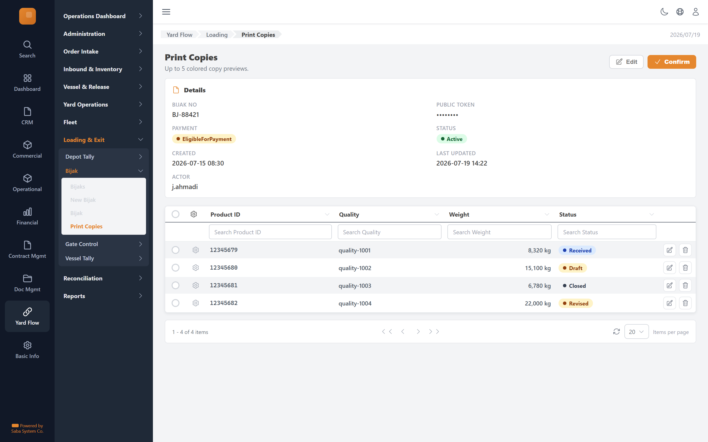

# Print Copies — implementation prompt

## Business context
- **Cluster:** Loading Pipeline (Phase 6)
- **Purpose:** Depot tally receipt → Bijak issue/print → gate exit → vessel receipt confirmation.
- **Actor:** Depot Tallyman, Control Office, Warehouse Guard, Vessel Tallyman
- **Workflow position:** `depot-tally-issue → bijak-new → bijak-workspace (issue/print) → gate-lookup/gate-mobile → vessel-tally-mobile → vessel-tally-detail`
- **Follows:** fleet-management
- **Precedes:** close-out

### Related screens in this cluster
- [Depot Tally Receipts](../depot-tally-list/prompt.md) (`/yard-flow/loading/depot-tally`)
- [Issue Depot Receipt](../depot-tally-issue/prompt.md) (`/yard-flow/loading/depot-tally/new`)
- [Depot Receipt](../depot-tally-detail/prompt.md) (`/yard-flow/loading/depot-tally/[id]`)
- [Field: Issue Receipt](../depot-tally-mobile/prompt.md) (`mobile`)
- [Bijaks](../bijak-list/prompt.md) (`/yard-flow/loading/bijak`)
- [Bijak](../bijak-workspace/prompt.md) (`/yard-flow/loading/bijak/[id]`)
- [New Bijak](../bijak-new/prompt.md) (`/yard-flow/loading/bijak/new`)
- [Gate Exits](../gate-exits-list/prompt.md) (`/yard-flow/loading/gate`)
- [Gate Exit](../gate-detail/prompt.md) (`/yard-flow/loading/gate/[id]`)
- [Gate Lookup & Confirm](../gate-lookup/prompt.md) (`/yard-flow/loading/gate/lookup`)
- [Field: Gate Confirm](../gate-mobile/prompt.md) (`mobile`)
- [Vessel Receipts](../vessel-tally-list/prompt.md) (`/yard-flow/loading/vessel-tally`)
- [Vessel Receipt](../vessel-tally-detail/prompt.md) (`/yard-flow/loading/vessel-tally/[id]`)
- [Field: Vessel Receipt](../vessel-tally-mobile/prompt.md) (`mobile`)

## Goal
Print Copies screen in the **Loading Pipeline** cluster. Used by Depot Tallyman, Control Office, Warehouse Guard, Vessel Tallyman.

## Route & placement
- Route: `/yard-flow/loading/bijak/[id]/print`
- Sidebar: Yard Flow (L1 rail) → Loading & Exit (L2 cluster) → route cluster → Print Copies (L4)
- Breadcrumb: Yard Flow / Loading / Print Copies
- Register in `getSidebarItems.ts` under top-level `yardFlow` key (same level as `commercial`)

## Backend API
- Base URL constant: `YF_BIJAK_BASE_URL` = `${BASE_URL}/api/bijak/v1`
- Endpoints:
  | Method | Path | Purpose | Request DTO | Response DTO |
  |--------|------|---------|-------------|--------------|
| `POST` | `/bijaks/{id}/print` | Print Copies action | — | — |
- Auth: mutations require `actor` field. Permissions: bijak.print.
- Note: Up to 5 colored copy previews.

## Data model (frontend types to add)
- `src/lib/types/yard-flow/response/bijak-print/get-bijak-print.dto.ts`
- `src/lib/types/yard-flow/request/bijak-print/create-bijak-print-request.dto.ts`

## UI spec
- Component pattern: **Detail view + actions**

- Toolbar actions mapped to endpoints listed above.
- Status badges use semantic tones (green=confirmed, amber=draft, red=rejected, blue=in-progress).
- States: loading skeleton, empty state, error toast, permission-gated hide/disable.
- Validation: Zod schema in `src/lib/schema/yard-flow/bijak-printSchema.ts`.

## Files to create
- `src/app/[locale]/yard-flow/...` — thin route wrapper
- `src/components/pages/yard-flow/loading-pipeline/bijak-print/`
- `src/services/yard-flow/bijakService.ts`
- `src/hooks/yard-flow/usePrintCopiesMutations.ts`
- Add under `yardFlow` in `src/utils/getSidebarItems.ts` (top-level sibling of commercial)
- Add `export const YF_BIJAK_BASE_URL = `${BASE_URL}/api/bijak/v1`;` to `src/constants/baseUrl.ts`

## Acceptance criteria
- [ ] Route renders with Yard Flow rail item active + correct cluster submenu highlight
- [ ] All API endpoints wired with correct DTOs
- [ ] Screen actions trigger correct endpoints
- [ ] Permission-gated UI elements respect roles
- [ ] Matches tms.frontend design tokens and shared components
