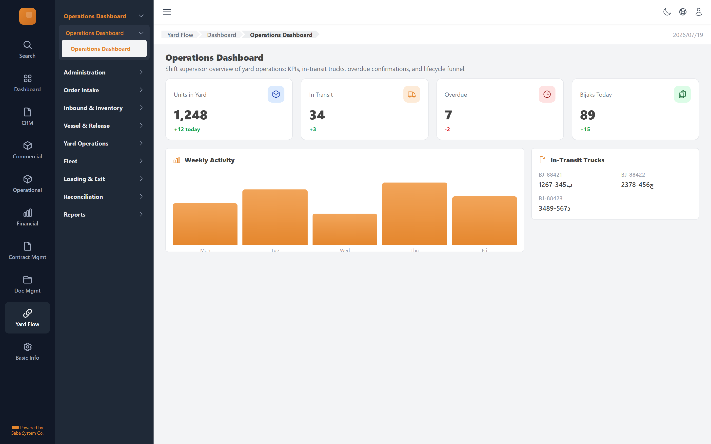

# Operations Dashboard — implementation prompt

## Business context
- **Cluster:** Overview (Phase 0)
- **Purpose:** Shift-level KPIs, in-transit trucks, overdue alerts, lifecycle funnel.
- **Actor:** Manager, Yard Shift Supervisor

- **Precedes:** order-intake

### Related screens in this cluster
—

## Goal
Shift supervisor overview of yard operations: KPIs, in-transit trucks, overdue confirmations, and lifecycle funnel.

## Route & placement
- Route: `/yard-flow`
- Sidebar: Yard Flow (L1 rail) → Operations Dashboard (L2 cluster) → route cluster → Operations Dashboard (L4)
- Breadcrumb: Yard Flow / Dashboard / Operations Dashboard
- Register in `getSidebarItems.ts` under top-level `yardFlow` key (same level as `commercial`)

## Backend API
- Base URL constant: `YF_REPORTING_BASE_URL` = `${BASE_URL}/api/reporting/v1`
- Endpoints:
  | Method | Path | Purpose | Request DTO | Response DTO |
  |--------|------|---------|-------------|--------------|
| `GET` | `/reports/inventory` | Operations Dashboard action | — | — |
| `GET` | `/reports/in-transit` | Operations Dashboard action | — | — |
| `GET` | `/reports/overdue` | Operations Dashboard action | — | — |
| `GET` | `/reports/loading` | Operations Dashboard action | — | — |
- Auth: mutations require `actor` field. Permissions: dashboards.read, reports.read.
- Note: Dashboard cards + charts; no CRUD.

## Data model (frontend types to add)
- `src/lib/types/yard-flow/response/dashboard/get-dashboard.dto.ts`
- `src/lib/types/yard-flow/request/dashboard/create-dashboard-request.dto.ts`

## UI spec
- Component pattern: **KPI cards + charts**

- Toolbar actions mapped to endpoints listed above.
- Status badges use semantic tones (green=confirmed, amber=draft, red=rejected, blue=in-progress).
- States: loading skeleton, empty state, error toast, permission-gated hide/disable.
- Validation: Zod schema in `src/lib/schema/yard-flow/dashboardSchema.ts`.

## Files to create
- `src/app/[locale]/yard-flow/...` — thin route wrapper
- `src/components/pages/yard-flow/overview/dashboard/`
- `src/services/yard-flow/reportingService.ts`
- `src/hooks/yard-flow/useOperationsDashboardMutations.ts`
- Add under `yardFlow` in `src/utils/getSidebarItems.ts` (top-level sibling of commercial)
- Add `export const YF_REPORTING_BASE_URL = `${BASE_URL}/api/reporting/v1`;` to `src/constants/baseUrl.ts`

## Acceptance criteria
- [ ] Route renders with Yard Flow rail item active + correct cluster submenu highlight
- [ ] All API endpoints wired with correct DTOs
- [ ] Screen actions trigger correct endpoints
- [ ] Permission-gated UI elements respect roles
- [ ] Matches tms.frontend design tokens and shared components
