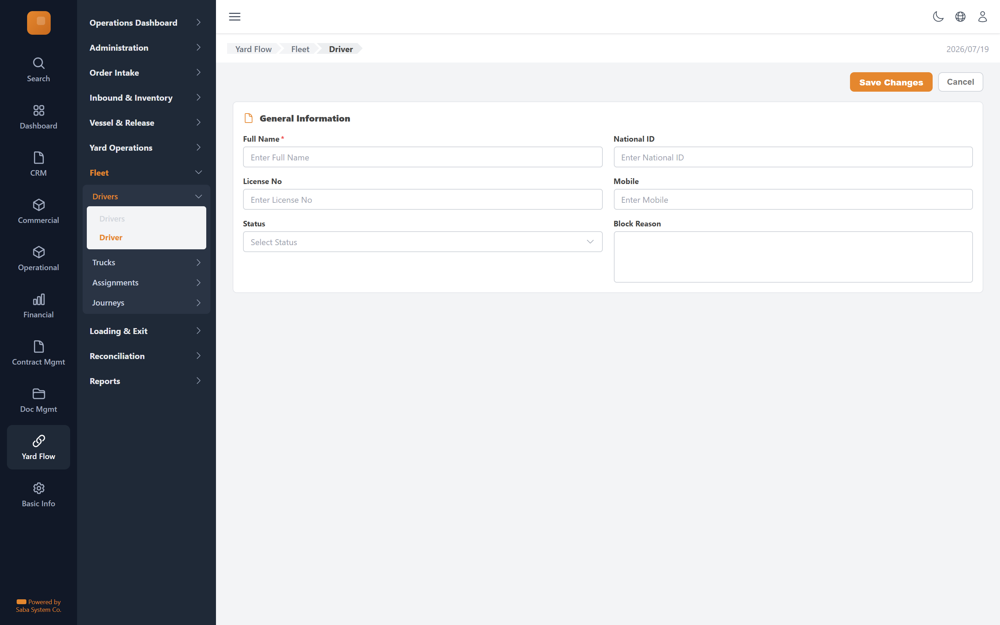

# Driver — implementation prompt

## Business context
- **Cluster:** Fleet Management (Phase 5)
- **Purpose:** Manage approved trucks/drivers, vessel-scoped assignments, truck service journeys.
- **Actor:** Guidance Operator
- **Workflow position:** `driver-form + truck-form → assignment-form → journeys-board → journey-detail`
- **Follows:** yard-operations
- **Precedes:** loading-pipeline

### Related screens in this cluster
- [Drivers](../drivers-list/prompt.md) (`/yard-flow/fleet/drivers`)
- [Trucks](../trucks-list/prompt.md) (`/yard-flow/fleet/trucks`)
- [Truck](../truck-form/prompt.md) (`/yard-flow/fleet/trucks/new`)
- [Assignments](../assignments-list/prompt.md) (`/yard-flow/fleet/assignments`)
- [Assignment](../assignment-form/prompt.md) (`/yard-flow/fleet/assignments/new`)
- [Journeys](../journeys-board/prompt.md) (`/yard-flow/fleet/journeys`)
- [Journey](../journey-detail/prompt.md) (`/yard-flow/fleet/journeys/[id]`)

## Goal
Driver screen in the **Fleet Management** cluster. Used by Guidance Operator.

## Route & placement
- Route: `/yard-flow/fleet/drivers/new`
- Sidebar: Yard Flow (L1 rail) → Fleet (L2 cluster) → route cluster → Driver (L4)
- Breadcrumb: Yard Flow / Fleet / Driver
- Register in `getSidebarItems.ts` under top-level `yardFlow` key (same level as `commercial`)

## Backend API
- Base URL constant: `YF_FLEETGUIDANCE_BASE_URL` = `${BASE_URL}/api/fleetguidance/v1`
- Endpoints:
  | Method | Path | Purpose | Request DTO | Response DTO |
  |--------|------|---------|-------------|--------------|
| `POST` | `/drivers` | Driver action | — | — |
| `POST` | `/drivers/{id}/status` | Driver action | — | — |
- Auth: mutations require `actor` field. Permissions: .

## Data model (frontend types to add)
- `src/lib/types/yard-flow/response/driver-form/get-driver-form.dto.ts`
- `src/lib/types/yard-flow/request/driver-form/create-driver-form-request.dto.ts`

## UI spec
- Component pattern: **react-hook-form + Zod**

### Form fields
- **Full Name** — type: `text`, required
- **National ID** — type: `text`
- **License No** — type: `text`
- **Mobile** — type: `text`
- **Status** — type: `select`
- **Block Reason** — type: `textarea`
- Toolbar actions mapped to endpoints listed above.
- Status badges use semantic tones (green=confirmed, amber=draft, red=rejected, blue=in-progress).
- States: loading skeleton, empty state, error toast, permission-gated hide/disable.
- Validation: Zod schema in `src/lib/schema/yard-flow/driver-formSchema.ts`.

## Files to create
- `src/app/[locale]/yard-flow/...` — thin route wrapper
- `src/components/pages/yard-flow/fleet-management/driver-form/`
- `src/services/yard-flow/fleetguidanceService.ts`
- `src/hooks/yard-flow/useDriverMutations.ts`
- Add under `yardFlow` in `src/utils/getSidebarItems.ts` (top-level sibling of commercial)
- Add `export const YF_FLEETGUIDANCE_BASE_URL = `${BASE_URL}/api/fleetguidance/v1`;` to `src/constants/baseUrl.ts`

## Acceptance criteria
- [ ] Route renders with Yard Flow rail item active + correct cluster submenu highlight
- [ ] All API endpoints wired with correct DTOs
- [ ] Form validates and submits via mutation hook
- [ ] Permission-gated UI elements respect roles
- [ ] Matches tms.frontend design tokens and shared components
