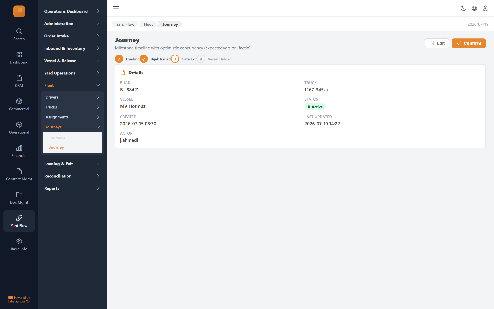

# Journey — implementation prompt

## Business context
- **Cluster:** Fleet Management (Phase 5)
- **Purpose:** Manage approved trucks/drivers, vessel-scoped assignments, truck service journeys.
- **Actor:** Guidance Operator
- **Workflow position:** `driver-form + truck-form → assignment-form → journeys-board → journey-detail`
- **Follows:** yard-operations
- **Precedes:** loading-pipeline

### Related screens in this cluster
- [Drivers](../drivers-list/prompt.md) (`/yard-flow/fleet/drivers`)
- [Driver](../driver-form/prompt.md) (`/yard-flow/fleet/drivers/new`)
- [Trucks](../trucks-list/prompt.md) (`/yard-flow/fleet/trucks`)
- [Truck](../truck-form/prompt.md) (`/yard-flow/fleet/trucks/new`)
- [Assignments](../assignments-list/prompt.md) (`/yard-flow/fleet/assignments`)
- [Assignment](../assignment-form/prompt.md) (`/yard-flow/fleet/assignments/new`)
- [Journeys](../journeys-board/prompt.md) (`/yard-flow/fleet/journeys`)

## Goal
Journey screen in the **Fleet Management** cluster. Used by Guidance Operator.

## Route & placement
- Route: `/yard-flow/fleet/journeys/[id]`
- Sidebar: Yard Flow (L1 rail) → Fleet (L2 cluster) → route cluster → Journey (L4)
- Breadcrumb: Yard Flow / Fleet / Journey
- Register in `getSidebarItems.ts` under top-level `yardFlow` key (same level as `commercial`)

## Backend API
- Base URL constant: `YF_FLEETGUIDANCE_BASE_URL` = `${BASE_URL}/api/fleetguidance/v1`
- Endpoints:
  | Method | Path | Purpose | Request DTO | Response DTO |
  |--------|------|---------|-------------|--------------|
| `GET` | `/journeys/{id}` | Journey action | — | — |
| `POST` | `/journeys/{id}/bijak-issued` | Journey action | — | — |
| `POST` | `/journeys/{id}/gate-exit` | Journey action | — | — |
| `POST` | `/journeys/{id}/confirm-vessel-unload` | Journey action | — | — |
- Auth: mutations require `actor` field. Permissions: .
- Note: Milestone timeline with optimistic concurrency (expectedVersion, factId).

## Data model (frontend types to add)
- `src/lib/types/yard-flow/response/journey-detail/get-journey-detail.dto.ts`
- `src/lib/types/yard-flow/request/journey-detail/create-journey-detail-request.dto.ts`

## UI spec
- Component pattern: **Detail view + actions**

- Toolbar actions mapped to endpoints listed above.
- Status badges use semantic tones (green=confirmed, amber=draft, red=rejected, blue=in-progress).
- States: loading skeleton, empty state, error toast, permission-gated hide/disable.
- Validation: Zod schema in `src/lib/schema/yard-flow/journey-detailSchema.ts`.

## Files to create
- `src/app/[locale]/yard-flow/...` — thin route wrapper
- `src/components/pages/yard-flow/fleet-management/journey-detail/`
- `src/services/yard-flow/fleetguidanceService.ts`
- `src/hooks/yard-flow/useJourneyMutations.ts`
- Add under `yardFlow` in `src/utils/getSidebarItems.ts` (top-level sibling of commercial)
- Add `export const YF_FLEETGUIDANCE_BASE_URL = `${BASE_URL}/api/fleetguidance/v1`;` to `src/constants/baseUrl.ts`

## Acceptance criteria
- [ ] Route renders with Yard Flow rail item active + correct cluster submenu highlight
- [ ] All API endpoints wired with correct DTOs
- [ ] Screen actions trigger correct endpoints
- [ ] Permission-gated UI elements respect roles
- [ ] Matches tms.frontend design tokens and shared components
