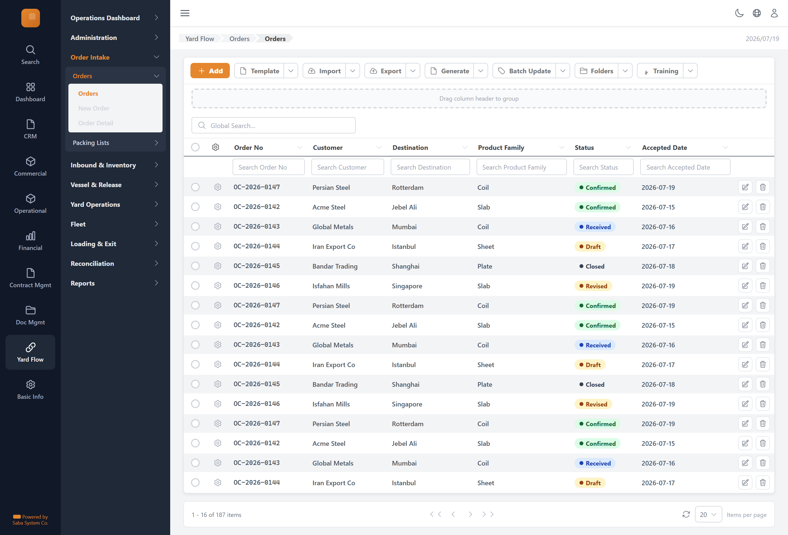

# Orders — implementation prompt

## Business context
- **Cluster:** Order Intake (Phase 1)
- **Purpose:** Register export orders, import packing lists, reconcile against expected cargo.
- **Actor:** Order Operator
- **Workflow position:** `orders-list → order-form → order-detail → packing-list-reconcile → confirm`
- **Follows:** overview, administration
- **Precedes:** inbound-inventory

### Related screens in this cluster
- [Order Detail](../order-detail/prompt.md) (`/yard-flow/orders/[id]`)
- [New Order](../order-form/prompt.md) (`/yard-flow/orders/new`)
- [Packing Lists](../packing-lists-list/prompt.md) (`/yard-flow/orders/packing-lists`)
- [Packing List Reconciliation](../packing-list-reconcile/prompt.md) (`/yard-flow/orders/[id]/packing-list`)

## Goal
Orders screen in the **Order Intake** cluster. Used by Order Operator.

## Route & placement
- Route: `/yard-flow/orders`
- Sidebar: Yard Flow (L1 rail) → Order Intake (L2 cluster) → route cluster → Orders (L4)
- Breadcrumb: Yard Flow / Orders / Orders
- Register in `getSidebarItems.ts` under top-level `yardFlow` key (same level as `commercial`)

## Backend API
- Base URL constant: `YF_ORDERCONFIRMATION_BASE_URL` = `${BASE_URL}/api/orderconfirmation/v1`
- Endpoints:
  | Method | Path | Purpose | Request DTO | Response DTO |
  |--------|------|---------|-------------|--------------|
| `GET` | `/orders` | Orders action | — | — |
| `POST` | `/orders` | Orders action | — | — |
- Auth: mutations require `actor` field. Permissions: orders.write.

## Data model (frontend types to add)
- `src/lib/types/yard-flow/response/orders-list/get-orders-list.dto.ts`
- `src/lib/types/yard-flow/request/orders-list/create-orders-list-request.dto.ts`
- Enums: `src/lib/enums/yard-flow/orderconfirmation-status.enum.ts` — values: Received, Confirmed, Revised, Closed

## UI spec
- Component pattern: **GenericTable**
### Columns
- **Order No** (`orderNo`) — filter: text
- **Customer** (`customer`) — filter: text
- **Destination** (`destination`) — filter: text
- **Product Family** (`productFamily`) — filter: text
- **Status** (`status`) — filter: text, status badge
- **Accepted Date** (`date`) — filter: text

- Toolbar actions mapped to endpoints listed above.
- Status badges use semantic tones (green=confirmed, amber=draft, red=rejected, blue=in-progress).
- States: loading skeleton, empty state, error toast, permission-gated hide/disable.
- Validation: Zod schema in `src/lib/schema/yard-flow/orders-listSchema.ts`.

## Files to create
- `src/app/[locale]/yard-flow/...` — thin route wrapper
- `src/components/pages/yard-flow/order-intake/orders-list/`
- `src/services/yard-flow/orderconfirmationService.ts`
- `src/hooks/yard-flow/useOrdersMutations.ts`
- Add under `yardFlow` in `src/utils/getSidebarItems.ts` (top-level sibling of commercial)
- Add `export const YF_ORDERCONFIRMATION_BASE_URL = `${BASE_URL}/api/orderconfirmation/v1`;` to `src/constants/baseUrl.ts`

## Acceptance criteria
- [ ] Route renders with Yard Flow rail item active + correct cluster submenu highlight
- [ ] All API endpoints wired with correct DTOs
- [ ] Grid columns, filters, pagination match spec
- [ ] Permission-gated UI elements respect roles
- [ ] Matches tms.frontend design tokens and shared components
