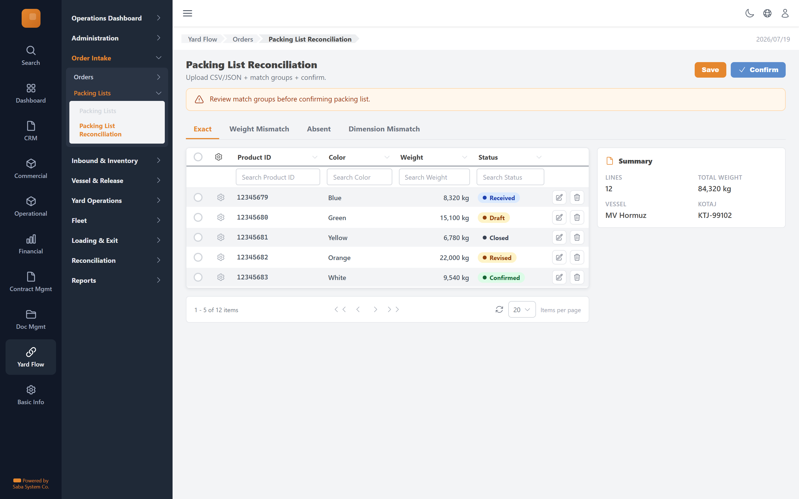

# Packing List Reconciliation — implementation prompt

## Business context
- **Cluster:** Order Intake (Phase 1)
- **Purpose:** Register export orders, import packing lists, reconcile against expected cargo.
- **Actor:** Order Operator
- **Workflow position:** `orders-list → order-form → order-detail → packing-list-reconcile → confirm`
- **Follows:** overview, administration
- **Precedes:** inbound-inventory

### Related screens in this cluster
- [Orders](../orders-list/prompt.md) (`/yard-flow/orders`)
- [Order Detail](../order-detail/prompt.md) (`/yard-flow/orders/[id]`)
- [New Order](../order-form/prompt.md) (`/yard-flow/orders/new`)
- [Packing Lists](../packing-lists-list/prompt.md) (`/yard-flow/orders/packing-lists`)

## Goal
Packing List Reconciliation screen in the **Order Intake** cluster. Used by Order Operator.

## Route & placement
- Route: `/yard-flow/orders/[id]/packing-list`
- Sidebar: Yard Flow (L1 rail) → Order Intake (L2 cluster) → route cluster → Packing List Reconciliation (L4)
- Breadcrumb: Yard Flow / Orders / Packing List Reconciliation
- Register in `getSidebarItems.ts` under top-level `yardFlow` key (same level as `commercial`)

## Backend API
- Base URL constant: `YF_ORDERCONFIRMATION_BASE_URL` = `${BASE_URL}/api/orderconfirmation/v1`
- Endpoints:
  | Method | Path | Purpose | Request DTO | Response DTO |
  |--------|------|---------|-------------|--------------|
| `POST` | `/orders/{id}/packing-lists` | Packing List Reconciliation action | — | — |
| `GET` | `/orders/{id}/packing-list` | Packing List Reconciliation action | — | — |
| `POST` | `/packing-lists/{id}/confirm` | Packing List Reconciliation action | — | — |
- Auth: mutations require `actor` field. Permissions: packinglist.approve.
- Note: Upload CSV/JSON + match groups + confirm.

## Data model (frontend types to add)
- `src/lib/types/yard-flow/response/packing-list-reconcile/get-packing-list-reconcile.dto.ts`
- `src/lib/types/yard-flow/request/packing-list-reconcile/create-packing-list-reconcile-request.dto.ts`
- Enums: `src/lib/enums/yard-flow/orderconfirmation-status.enum.ts` — values: Exact, AbsentFromInventory, WeightMismatch, ItemOrDimensionMismatch, DuplicateFileRow, Unavailable

## UI spec
- Component pattern: **Form + DynamicTable workspace**

- Toolbar actions mapped to endpoints listed above.
- Status badges use semantic tones (green=confirmed, amber=draft, red=rejected, blue=in-progress).
- States: loading skeleton, empty state, error toast, permission-gated hide/disable.
- Validation: Zod schema in `src/lib/schema/yard-flow/packing-list-reconcileSchema.ts`.

## Files to create
- `src/app/[locale]/yard-flow/...` — thin route wrapper
- `src/components/pages/yard-flow/order-intake/packing-list-reconcile/`
- `src/services/yard-flow/orderconfirmationService.ts`
- `src/hooks/yard-flow/usePackingListReconciliationMutations.ts`
- Add under `yardFlow` in `src/utils/getSidebarItems.ts` (top-level sibling of commercial)
- Add `export const YF_ORDERCONFIRMATION_BASE_URL = `${BASE_URL}/api/orderconfirmation/v1`;` to `src/constants/baseUrl.ts`

## Acceptance criteria
- [ ] Route renders with Yard Flow rail item active + correct cluster submenu highlight
- [ ] All API endpoints wired with correct DTOs
- [ ] Screen actions trigger correct endpoints
- [ ] Permission-gated UI elements respect roles
- [ ] Matches tms.frontend design tokens and shared components
