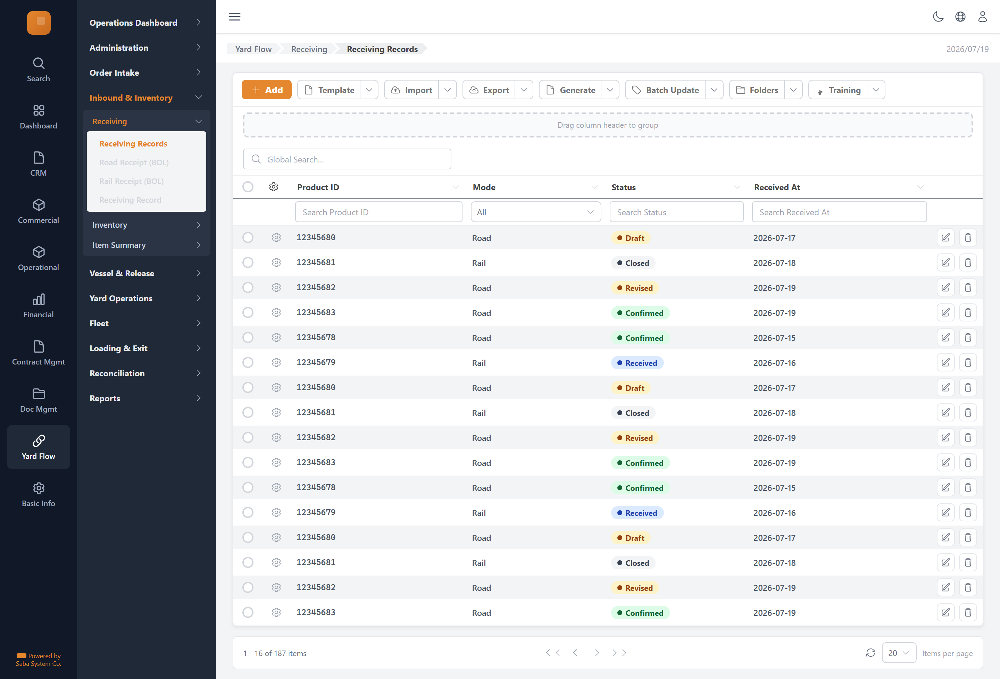

# Receiving Records — implementation prompt

## Business context
- **Cluster:** Inbound & Inventory (Phase 2)
- **Purpose:** Register road/rail BOL receipts, project units into inventory, search and track lifecycle.
- **Actor:** Control Office Operator, Yard Operator
- **Workflow position:** `road/rail-receipt-form → receiving-detail → inventory-search → product-unit-detail`
- **Follows:** order-intake
- **Precedes:** vessel-release

### Related screens in this cluster
- [Road Receipt (BOL)](../road-receipt-form/prompt.md) (`/yard-flow/receiving/road/new`)
- [Rail Receipt (BOL)](../rail-receipt-form/prompt.md) (`/yard-flow/receiving/rail/new`)
- [Receiving Record](../receiving-detail/prompt.md) (`/yard-flow/receiving/[id]`)
- [Inventory Search](../inventory-search/prompt.md) (`/yard-flow/inventory`)
- [Product Unit](../product-unit-detail/prompt.md) (`/yard-flow/inventory/[id]`)
- [Item Summary](../item-summary/prompt.md) (`/yard-flow/inventory/item-summary`)

## Goal
Receiving Records screen in the **Inbound & Inventory** cluster. Used by Control Office Operator, Yard Operator.

## Route & placement
- Route: `/yard-flow/receiving`
- Sidebar: Yard Flow (L1 rail) → Inbound & Inventory (L2 cluster) → route cluster → Receiving Records (L4)
- Breadcrumb: Yard Flow / Receiving / Receiving Records
- Register in `getSidebarItems.ts` under top-level `yardFlow` key (same level as `commercial`)

## Backend API
- Base URL constant: `YF_RECEIVING_BASE_URL` = `${BASE_URL}/api/receiving/v1`
- Endpoints:
  | Method | Path | Purpose | Request DTO | Response DTO |
  |--------|------|---------|-------------|--------------|
| `GET` | `/records` | Receiving Records action | — | — |
- Auth: mutations require `actor` field. Permissions: receiving.write.

## Data model (frontend types to add)
- `src/lib/types/yard-flow/response/receiving-list/get-receiving-list.dto.ts`
- `src/lib/types/yard-flow/request/receiving-list/create-receiving-list-request.dto.ts`
- Enums: `src/lib/enums/yard-flow/receiving-status.enum.ts` — values: Received, PendingMatching, Discrepant, Approved, Corrected, Cancelled

## UI spec
- Component pattern: **GenericTable**
### Columns
- **Product ID** (`productId`) — filter: text
- **Mode** (`mode`) — filter: enum
- **Status** (`status`) — filter: text, status badge
- **Received At** (`date`) — filter: text

- Toolbar actions mapped to endpoints listed above.
- Status badges use semantic tones (green=confirmed, amber=draft, red=rejected, blue=in-progress).
- States: loading skeleton, empty state, error toast, permission-gated hide/disable.
- Validation: Zod schema in `src/lib/schema/yard-flow/receiving-listSchema.ts`.

## Files to create
- `src/app/[locale]/yard-flow/...` — thin route wrapper
- `src/components/pages/yard-flow/inbound-inventory/receiving-list/`
- `src/services/yard-flow/receivingService.ts`
- `src/hooks/yard-flow/useReceivingRecordsMutations.ts`
- Add under `yardFlow` in `src/utils/getSidebarItems.ts` (top-level sibling of commercial)
- Add `export const YF_RECEIVING_BASE_URL = `${BASE_URL}/api/receiving/v1`;` to `src/constants/baseUrl.ts`

## Acceptance criteria
- [ ] Route renders with Yard Flow rail item active + correct cluster submenu highlight
- [ ] All API endpoints wired with correct DTOs
- [ ] Grid columns, filters, pagination match spec
- [ ] Permission-gated UI elements respect roles
- [ ] Matches tms.frontend design tokens and shared components
