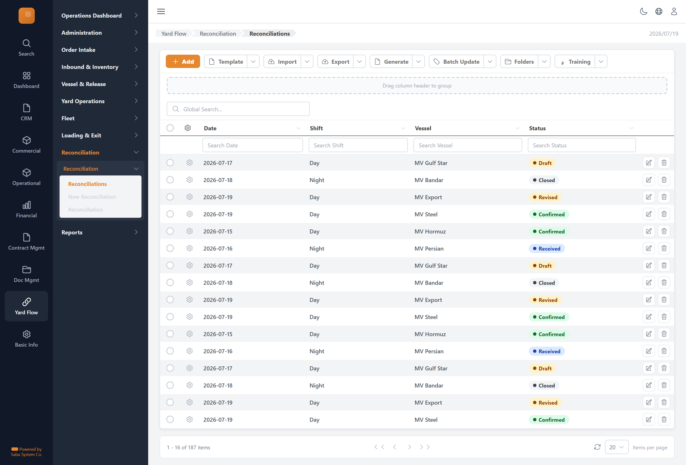

# Reconciliations — implementation prompt

## Business context
- **Cluster:** Close-out (Phase 7)
- **Purpose:** End-of-shift reconciliation: expected vs counted metrics, resolve discrepancies, close.
- **Actor:** Terminal Reviewer
- **Workflow position:** `reconciliation-new → reconciliation-workspace → resolve discrepancies → close`
- **Follows:** loading-pipeline
- **Precedes:** reports

### Related screens in this cluster
- [Reconciliation](../reconciliation-workspace/prompt.md) (`/yard-flow/reconciliation/[id]`)
- [New Reconciliation](../reconciliation-new/prompt.md) (`/yard-flow/reconciliation/new`)

## Goal
Reconciliations screen in the **Close-out** cluster. Used by Terminal Reviewer.

## Route & placement
- Route: `/yard-flow/reconciliation`
- Sidebar: Yard Flow (L1 rail) → Reconciliation (L2 cluster) → route cluster → Reconciliations (L4)
- Breadcrumb: Yard Flow / Reconciliation / Reconciliations
- Register in `getSidebarItems.ts` under top-level `yardFlow` key (same level as `commercial`)

## Backend API
- Base URL constant: `YF_RECONCILIATION_BASE_URL` = `${BASE_URL}/api/reconciliation/v1`
- Endpoints:
  | Method | Path | Purpose | Request DTO | Response DTO |
  |--------|------|---------|-------------|--------------|
| `GET` | `/reconciliations` | Reconciliations action | — | — |
| `POST` | `/reconciliations` | Reconciliations action | — | — |
- Auth: mutations require `actor` field. Permissions: .

## Data model (frontend types to add)
- `src/lib/types/yard-flow/response/reconciliations-list/get-reconciliations-list.dto.ts`
- `src/lib/types/yard-flow/request/reconciliations-list/create-reconciliations-list-request.dto.ts`
- Enums: `src/lib/enums/yard-flow/reconciliation-status.enum.ts` — values: Draft, Closed

## UI spec
- Component pattern: **GenericTable**
### Columns
- **Date** (`date`) — filter: text
- **Shift** (`shift`) — filter: text
- **Vessel** (`vessel`) — filter: text
- **Status** (`status`) — filter: text, status badge

- Toolbar actions mapped to endpoints listed above.
- Status badges use semantic tones (green=confirmed, amber=draft, red=rejected, blue=in-progress).
- States: loading skeleton, empty state, error toast, permission-gated hide/disable.
- Validation: Zod schema in `src/lib/schema/yard-flow/reconciliations-listSchema.ts`.

## Files to create
- `src/app/[locale]/yard-flow/...` — thin route wrapper
- `src/components/pages/yard-flow/close-out/reconciliations-list/`
- `src/services/yard-flow/reconciliationService.ts`
- `src/hooks/yard-flow/useReconciliationsMutations.ts`
- Add under `yardFlow` in `src/utils/getSidebarItems.ts` (top-level sibling of commercial)
- Add `export const YF_RECONCILIATION_BASE_URL = `${BASE_URL}/api/reconciliation/v1`;` to `src/constants/baseUrl.ts`

## Acceptance criteria
- [ ] Route renders with Yard Flow rail item active + correct cluster submenu highlight
- [ ] All API endpoints wired with correct DTOs
- [ ] Grid columns, filters, pagination match spec
- [ ] Permission-gated UI elements respect roles
- [ ] Matches tms.frontend design tokens and shared components
