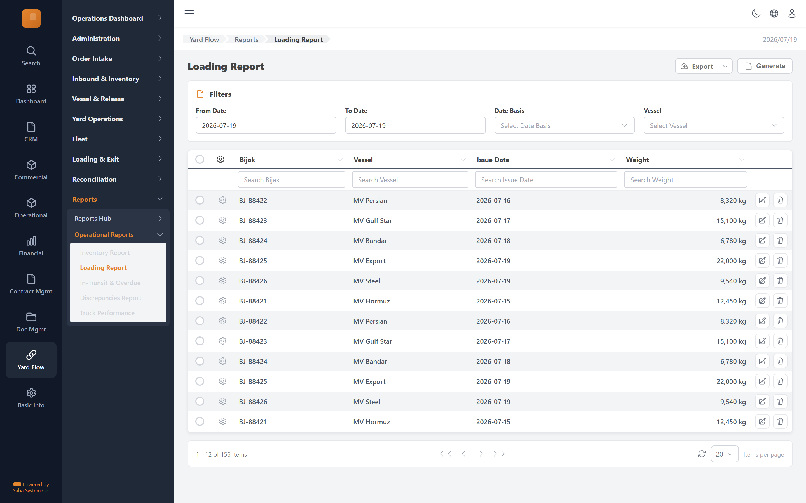

# Loading Report — implementation prompt

## Business context
- **Cluster:** Reports & Analytics (Phase 8)
- **Purpose:** Operational and audit reports across the full lifecycle.
- **Actor:** Manager, Terminal Reviewer

- **Follows:** close-out

### Related screens in this cluster
- [Reports Hub](../reports-hub/prompt.md) (`/yard-flow/reports`)
- [Inventory Report](../report-inventory/prompt.md) (`/yard-flow/reports/inventory`)
- [In-Transit & Overdue](../report-in-transit-overdue/prompt.md) (`/yard-flow/reports/in-transit`)
- [Discrepancies Report](../report-discrepancies/prompt.md) (`/yard-flow/reports/discrepancies`)
- [Truck Performance](../report-truck-performance/prompt.md) (`/yard-flow/reports/truck-performance`)

## Goal
Loading Report screen in the **Reports & Analytics** cluster. Used by Manager, Terminal Reviewer.

## Route & placement
- Route: `/yard-flow/reports/loading`
- Sidebar: Yard Flow (L1 rail) → Reports (L2 cluster) → route cluster → Loading Report (L4)
- Breadcrumb: Yard Flow / Reports / Loading Report
- Register in `getSidebarItems.ts` under top-level `yardFlow` key (same level as `commercial`)

## Backend API
- Base URL constant: `YF_REPORTING_BASE_URL` = `${BASE_URL}/api/reporting/v1`
- Endpoints:
  | Method | Path | Purpose | Request DTO | Response DTO |
  |--------|------|---------|-------------|--------------|
| `GET` | `/reports/loading` | Loading Report action | — | — |
- Auth: mutations require `actor` field. Permissions: .

## Data model (frontend types to add)
- `src/lib/types/yard-flow/response/report-loading/get-report-loading.dto.ts`
- `src/lib/types/yard-flow/request/report-loading/create-report-loading-request.dto.ts`

## UI spec
- Component pattern: **Filters + GenericTable report**
### Columns
- **Bijak** (`bijakNo`) — filter: text
- **Vessel** (`vessel`) — filter: text
- **Issue Date** (`date`) — filter: text
- **Weight** (`weight`) — filter: text

- Toolbar actions mapped to endpoints listed above.
- Status badges use semantic tones (green=confirmed, amber=draft, red=rejected, blue=in-progress).
- States: loading skeleton, empty state, error toast, permission-gated hide/disable.
- Validation: Zod schema in `src/lib/schema/yard-flow/report-loadingSchema.ts`.

## Files to create
- `src/app/[locale]/yard-flow/...` — thin route wrapper
- `src/components/pages/yard-flow/reports/report-loading/`
- `src/services/yard-flow/reportingService.ts`
- `src/hooks/yard-flow/useLoadingReportMutations.ts`
- Add under `yardFlow` in `src/utils/getSidebarItems.ts` (top-level sibling of commercial)
- Add `export const YF_REPORTING_BASE_URL = `${BASE_URL}/api/reporting/v1`;` to `src/constants/baseUrl.ts`

## Acceptance criteria
- [ ] Route renders with Yard Flow rail item active + correct cluster submenu highlight
- [ ] All API endpoints wired with correct DTOs
- [ ] Grid columns, filters, pagination match spec
- [ ] Permission-gated UI elements respect roles
- [ ] Matches tms.frontend design tokens and shared components
