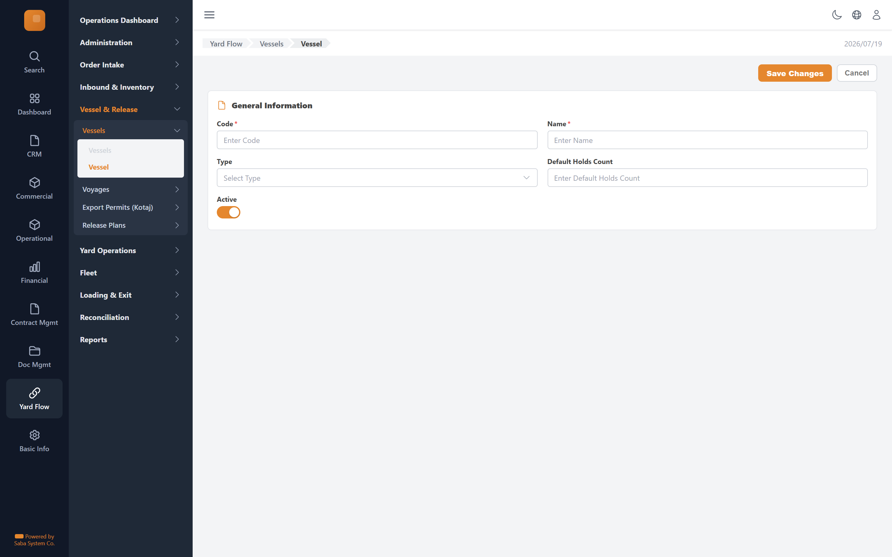

# Vessel — implementation prompt

## Business context
- **Cluster:** Vessel Planning & Release (Phase 3)
- **Purpose:** Register vessels/voyages/Kotaj, create release plans allocating units to vessels.
- **Actor:** Control Office Operator, Manager
- **Workflow position:** `vessel-form → voyage-form → export-permit-form → release-plan-new → release-plan-workspace → confirm`
- **Follows:** inbound-inventory
- **Precedes:** yard-operations

### Related screens in this cluster
- [Vessels](../vessels-list/prompt.md) (`/yard-flow/vessels`)
- [Voyages](../voyages-list/prompt.md) (`/yard-flow/vessels/voyages`)
- [Voyage](../voyage-form/prompt.md) (`/yard-flow/vessels/voyages/new`)
- [Export Permits (Kotaj)](../export-permits-list/prompt.md) (`/yard-flow/vessels/export-permits`)
- [Export Permit](../export-permit-form/prompt.md) (`/yard-flow/vessels/export-permits/new`)
- [Release Plans](../release-plans-list/prompt.md) (`/yard-flow/release`)
- [Release Plan](../release-plan-workspace/prompt.md) (`/yard-flow/release/[id]`)
- [New Release Plan](../release-plan-new/prompt.md) (`/yard-flow/release/new`)

## Goal
Vessel screen in the **Vessel Planning & Release** cluster. Used by Control Office Operator, Manager.

## Route & placement
- Route: `/yard-flow/vessels/new`
- Sidebar: Yard Flow (L1 rail) → Vessel & Release (L2 cluster) → route cluster → Vessel (L4)
- Breadcrumb: Yard Flow / Vessels / Vessel
- Register in `getSidebarItems.ts` under top-level `yardFlow` key (same level as `commercial`)

## Backend API
- Base URL constant: `YF_VESSEL_BASE_URL` = `${BASE_URL}/api/vessel/v1`
- Endpoints:
  | Method | Path | Purpose | Request DTO | Response DTO |
  |--------|------|---------|-------------|--------------|
| `POST` | `/vessels` | Vessel action | — | — |
| `POST` | `/vessels/{id}/status` | Vessel action | — | — |
- Auth: mutations require `actor` field. Permissions: .

## Data model (frontend types to add)
- `src/lib/types/yard-flow/response/vessel-form/get-vessel-form.dto.ts`
- `src/lib/types/yard-flow/request/vessel-form/create-vessel-form-request.dto.ts`
- Enums: `src/lib/enums/yard-flow/vessel-status.enum.ts` — values: Ship, Barge, SmallVessel

## UI spec
- Component pattern: **react-hook-form + Zod**

### Form fields
- **Code** — type: `text`, required
- **Name** — type: `text`, required
- **Type** — type: `select`
- **Default Holds Count** — type: `number`
- **Active** — type: `toggle`
- Toolbar actions mapped to endpoints listed above.
- Status badges use semantic tones (green=confirmed, amber=draft, red=rejected, blue=in-progress).
- States: loading skeleton, empty state, error toast, permission-gated hide/disable.
- Validation: Zod schema in `src/lib/schema/yard-flow/vessel-formSchema.ts`.

## Files to create
- `src/app/[locale]/yard-flow/...` — thin route wrapper
- `src/components/pages/yard-flow/vessel-release/vessel-form/`
- `src/services/yard-flow/vesselService.ts`
- `src/hooks/yard-flow/useVesselMutations.ts`
- Add under `yardFlow` in `src/utils/getSidebarItems.ts` (top-level sibling of commercial)
- Add `export const YF_VESSEL_BASE_URL = `${BASE_URL}/api/vessel/v1`;` to `src/constants/baseUrl.ts`

## Acceptance criteria
- [ ] Route renders with Yard Flow rail item active + correct cluster submenu highlight
- [ ] All API endpoints wired with correct DTOs
- [ ] Form validates and submits via mutation hook
- [ ] Permission-gated UI elements respect roles
- [ ] Matches tms.frontend design tokens and shared components
