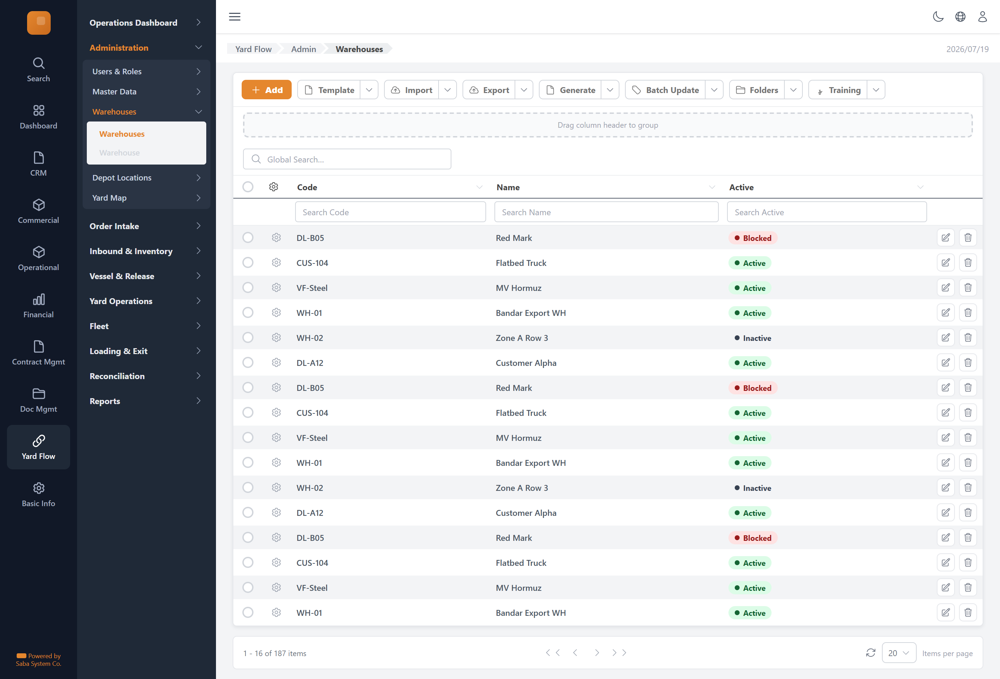

# Warehouses — implementation prompt

## Business context
- **Cluster:** Administration (Phase 0)
- **Purpose:** Users, roles, master data, warehouses, depot locations, yard map.
- **Actor:** Admin, Manager

- **Precedes:** order-intake

### Related screens in this cluster
- [Users](../users-list/prompt.md) (`/yard-flow/admin/users`)
- [User](../user-form/prompt.md) (`/yard-flow/admin/users/new`)
- [Roles & Permissions](../roles-permissions/prompt.md) (`/yard-flow/admin/roles`)
- [Master Data](../master-data/prompt.md) (`/yard-flow/admin/master-data`)
- [Master Data Record](../master-data-form/prompt.md) (`/yard-flow/admin/master-data/new`)
- [Warehouse](../warehouse-form/prompt.md) (`/yard-flow/admin/warehouses/new`)
- [Depot Locations](../depot-locations-list/prompt.md) (`/yard-flow/admin/depot-locations`)
- [Depot Location](../depot-location-form/prompt.md) (`/yard-flow/admin/depot-locations/new`)
- [Yard Map](../yard-map/prompt.md) (`/yard-flow/admin/yard-map`)

## Goal
Warehouses screen in the **Administration** cluster. Used by Admin, Manager.

## Route & placement
- Route: `/yard-flow/admin/warehouses`
- Sidebar: Yard Flow (L1 rail) → Administration (L2 cluster) → route cluster → Warehouses (L4)
- Breadcrumb: Yard Flow / Admin / Warehouses
- Register in `getSidebarItems.ts` under top-level `yardFlow` key (same level as `commercial`)

## Backend API
- Base URL constant: `YF_YARDLOCATION_BASE_URL` = `${BASE_URL}/api/yardlocation/v1`
- Endpoints:
  | Method | Path | Purpose | Request DTO | Response DTO |
  |--------|------|---------|-------------|--------------|
| `GET` | `/warehouses` | Warehouses action | — | — |
| `POST` | `/warehouses` | Warehouses action | — | — |
- Auth: mutations require `actor` field. Permissions: yardlocation.write.

## Data model (frontend types to add)
- `src/lib/types/yard-flow/response/warehouses-list/get-warehouses-list.dto.ts`
- `src/lib/types/yard-flow/request/warehouses-list/create-warehouses-list-request.dto.ts`

## UI spec
- Component pattern: **GenericTable**
### Columns
- **Code** (`code`) — filter: text
- **Name** (`displayName`) — filter: text
- **Active** (`active`) — filter: text, status badge

- Toolbar actions mapped to endpoints listed above.
- Status badges use semantic tones (green=confirmed, amber=draft, red=rejected, blue=in-progress).
- States: loading skeleton, empty state, error toast, permission-gated hide/disable.
- Validation: Zod schema in `src/lib/schema/yard-flow/warehouses-listSchema.ts`.

## Files to create
- `src/app/[locale]/yard-flow/...` — thin route wrapper
- `src/components/pages/yard-flow/administration/warehouses-list/`
- `src/services/yard-flow/yardlocationService.ts`
- `src/hooks/yard-flow/useWarehousesMutations.ts`
- Add under `yardFlow` in `src/utils/getSidebarItems.ts` (top-level sibling of commercial)
- Add `export const YF_YARDLOCATION_BASE_URL = `${BASE_URL}/api/yardlocation/v1`;` to `src/constants/baseUrl.ts`

## Acceptance criteria
- [ ] Route renders with Yard Flow rail item active + correct cluster submenu highlight
- [ ] All API endpoints wired with correct DTOs
- [ ] Grid columns, filters, pagination match spec
- [ ] Permission-gated UI elements respect roles
- [ ] Matches tms.frontend design tokens and shared components
