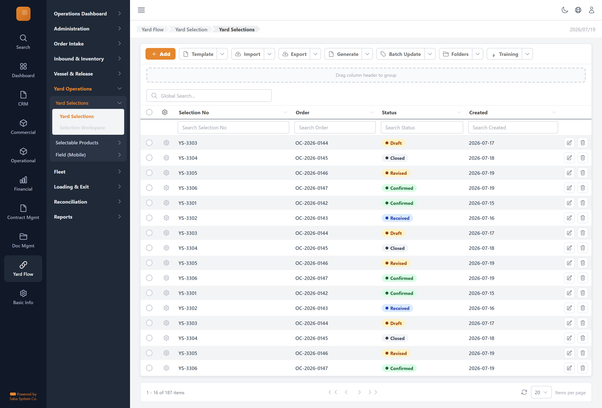

# Yard Selections — implementation prompt

## Business context
- **Cluster:** Yard Operations (Phase 4)
- **Purpose:** Select product units from yard, physically verify, apply color marks, convert to release.
- **Actor:** Yard Operator, Yard Shift Supervisor
- **Workflow position:** `selectable-products → yard-selection-workspace (claim → verify → mark) → convert-to-release`
- **Follows:** vessel-release
- **Precedes:** fleet-management

### Related screens in this cluster
- [Selection Workspace](../yard-selection-workspace/prompt.md) (`/yard-flow/yard-selection/[id]`)
- [Selectable Products](../selectable-products/prompt.md) (`/yard-flow/yard-selection/selectable`)
- [Field: Claim / Scan](../yard-selection-mobile-claim/prompt.md) (`mobile`)
- [Field: Verify](../yard-selection-mobile-verify/prompt.md) (`mobile`)
- [Field: Color Marking](../yard-selection-mobile-mark/prompt.md) (`mobile`)

## Goal
Yard Selections screen in the **Yard Operations** cluster. Used by Yard Operator, Yard Shift Supervisor.

## Route & placement
- Route: `/yard-flow/yard-selection`
- Sidebar: Yard Flow (L1 rail) → Yard Operations (L2 cluster) → route cluster → Yard Selections (L4)
- Breadcrumb: Yard Flow / Yard Selection / Yard Selections
- Register in `getSidebarItems.ts` under top-level `yardFlow` key (same level as `commercial`)

## Backend API
- Base URL constant: `YF_YARDSELECTION_BASE_URL` = `${BASE_URL}/api/yardselection/v1`
- Endpoints:
  | Method | Path | Purpose | Request DTO | Response DTO |
  |--------|------|---------|-------------|--------------|
| `GET` | `/yard-selections` | Yard Selections action | — | — |
| `POST` | `/yard-selections` | Yard Selections action | — | — |
- Auth: mutations require `actor` field. Permissions: yardselection.create.

## Data model (frontend types to add)
- `src/lib/types/yard-flow/response/yard-selections-list/get-yard-selections-list.dto.ts`
- `src/lib/types/yard-flow/request/yard-selections-list/create-yard-selections-list-request.dto.ts`
- Enums: `src/lib/enums/yard-flow/yardselection-status.enum.ts` — values: Draft, InProgress, PhysicallyVerified, ReadyForRelease, ConvertedToRelease, Cancelled

## UI spec
- Component pattern: **GenericTable**
### Columns
- **Selection No** (`selectionNo`) — filter: text
- **Order** (`orderNo`) — filter: text
- **Status** (`status`) — filter: text, status badge
- **Created** (`date`) — filter: text

- Toolbar actions mapped to endpoints listed above.
- Status badges use semantic tones (green=confirmed, amber=draft, red=rejected, blue=in-progress).
- States: loading skeleton, empty state, error toast, permission-gated hide/disable.
- Validation: Zod schema in `src/lib/schema/yard-flow/yard-selections-listSchema.ts`.

## Files to create
- `src/app/[locale]/yard-flow/...` — thin route wrapper
- `src/components/pages/yard-flow/yard-operations/yard-selections-list/`
- `src/services/yard-flow/yardselectionService.ts`
- `src/hooks/yard-flow/useYardSelectionsMutations.ts`
- Add under `yardFlow` in `src/utils/getSidebarItems.ts` (top-level sibling of commercial)
- Add `export const YF_YARDSELECTION_BASE_URL = `${BASE_URL}/api/yardselection/v1`;` to `src/constants/baseUrl.ts`

## Acceptance criteria
- [ ] Route renders with Yard Flow rail item active + correct cluster submenu highlight
- [ ] All API endpoints wired with correct DTOs
- [ ] Grid columns, filters, pagination match spec
- [ ] Permission-gated UI elements respect roles
- [ ] Matches tms.frontend design tokens and shared components
